<picture>
  <source media="(prefers-color-scheme: dark)" srcset="assets/header-dark.svg">
  <source media="(prefers-color-scheme: light)" srcset="assets/header-light.svg">
  
</picture>

<p align="center">
  <a href="mailto:eric07310115@gmail.com"></a> <a href="https://www.linkedin.com/in/eric-chu-b1394a2a1/"></a> <a href="https://medium.com/@eric07310115"></a>
</p>

I work on quantitative research where machine learning meets financial structure: models that stay close to pricing theory, use only point-in-time information, and are judged after transaction costs.

## `01` Research focus

| Area | Problem | Methods |
|---|---|---|
| **Constrained deep learning** | Option-pricing networks that stay close to pricing theory | PDE-style residual penalties · positive-weight input embeddings · ConvLSTM and Transformer encoders · moneyness and temporal positional encodings |
| **Cross-sectional alpha** | Point-in-time factor research, return ranking, regime-aware risk scaling | point-in-time factors with dynamic universe masking · size and sector neutralization · walk-forward gradient-boosting rankers tuned with Optuna · hidden Markov regime models · formulaic-alpha search with a Transformer generator |
| **Reinforcement learning** | Hierarchical agents for minute-level trading | MacroHFT-based hierarchical agents · ATR and PPO baselines · Multi-Patch Former state encoder · evaluation pipeline for all strategy variants |
| **Market microstructure** | Exchange simulation and short-horizon signals | asynchronous exchange simulator · matching against live order-book snapshots · maker and taker fees · delayed market-data release · order-book imbalance features |
| **Differentiable optimization** | Optimization problems as network layers | OptNet quadratic-programming layers · KKT implicit differentiation · primal–dual interior-point methods |

## `02` Selected work

| Repository | Summary | Stack |
|---|---|---|
| [`Constrained-Deep-Learning-for-Option-Pricing`](https://github.com/Ericchuchu/Constrained-Deep-Learning-for-Option-Pricing) | Undergraduate thesis. One-day-ahead pricing of TAIEX index options with a dual-branch ConvLSTM + Transformer network and a PDE-style residual penalty; stored test MSE is 48.7% below the ConvLSTM baseline. The README states what each constraint does and does not enforce | PyTorch · ConvLSTM · MultiPatchFormer · FANformer · Kou / FFT benchmark |
| [`MacroHFT`](https://github.com/Ericchuchu/MacroHFT) (team project, fork) | Hierarchical reinforcement learning for minute-level ETHUSDT trading, extending MacroHFT (KDD 2024) with a regime-aware Dynamic Hybrid coordinator. My part: ATR and PPO baselines, Multi-Patch Former integration and the evaluation pipeline | PyTorch · DQN variants · expert mixing |
| [`async-exchange-simulator`](https://github.com/Ericchuchu/async-exchange-simulator) | `asyncio` paper exchange: relays a live crypto-exchange feed, matches orders against the live order book, charges maker and taker fees, tracks hedge-mode positions, monitors P&L live. Built in a five-person trading training program; the README lists the modelling limits and what I did not write | asyncio · WebSockets · matching engine · unittest |
| [`Hangman-AI-Agent`](https://github.com/Ericchuchu/Hangman-AI-Agent) | Hangman agents: PPO and DQN with curriculum learning, per-letter XGBoost and CatBoost classifiers combined with dictionary pattern matching, and an ensemble solver that routes each guess by word length and attempts left | PyTorch · Gymnasium · XGBoost · CatBoost |
| [`twse-attention-stock-alerts`](https://github.com/Ericchuchu/twse-attention-stock-alerts) | Watches exchange disclosures of attention stocks, extracts EPS from free-form Chinese text, compares it with the previous quarter and pushes alerts to Telegram | Selenium · regex parsing · Telegram Bot API · Docker |
| [`bb-keltner-squeeze-sar`](https://github.com/Ericchuchu/bb-keltner-squeeze-sar) | Rule-based squeeze-breakout strategy with next-bar execution and commissions, tuned by searching for parameter plateaus instead of single optima | TA-Lib · vectorbt · Optuna NSGA-II · HiPlot |
| [`tw-stock-rnn-trading`](https://github.com/Ericchuchu/tw-stock-rnn-trading) · [`tw-stock-rnn-selection`](https://github.com/Ericchuchu/tw-stock-rnn-selection) | 2024 study that turns GRU / LSTM / ConvLSTM forecasts into trading rules, with a retrospective that reproduces the original backtests and measures how much of their profit came from look-ahead bias and missing costs | PyTorch · vectorbt · Optuna |

Current research code is proprietary and is not hosted here. The READMEs of my own repositories state what the code does and its known limitations; the research repositories also document their data and evaluation.

## `03` Stack

**Languages**&nbsp;   

**Modeling**&nbsp;       

**Scientific computing**&nbsp;   

**Backtesting and infrastructure**&nbsp;     

```text
optimization   constrained optimization · quadratic programming · Lagrangian duality
               KKT conditions · implicit differentiation
statistics     Gaussian processes · hidden Markov models · autoregressive models
finance        option pricing · factor modeling · exposure neutralization
               transaction-cost modeling · market microstructure · walk-forward validation
```

## `04` Writing

- [Deep Learning-Driven CTA Investment Decisions: Stock Price Prediction and Portfolio Management](https://medium.com/@eric07310115/deep-learning-driven-cta-investment-decisions-stock-price-prediction-and-portfolio-management-9b676da6d2f7) (Medium, 2024)
- [使用 Bollinger Bands – Keltner Squeeze 配合 SAR 指標的順勢交易策略](https://medium.com/@eric07310115/%E4%BD%BF%E7%94%A8-bollinger-bands-keltner-squeeze-%E9%85%8D%E5%90%88-sar-%E6%8C%87%E6%A8%99%E7%9A%84%E9%A0%86%E5%8B%A2%E4%BA%A4%E6%98%93%E7%AD%96%E7%95%A5-4c6ffab5b64c) (Medium, 2024, in Chinese): a trend-following strategy built on the Bollinger–Keltner squeeze with Parabolic SAR exits
